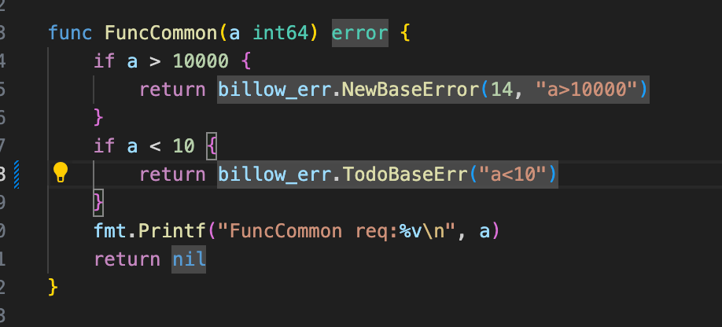
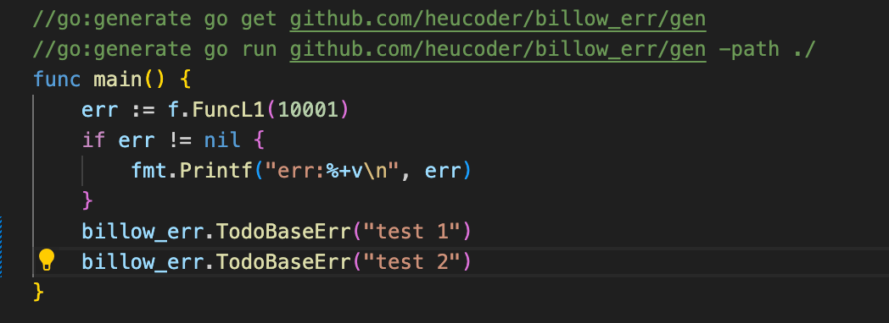
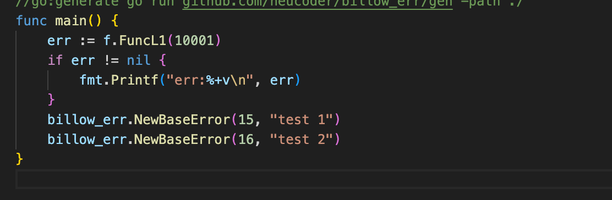
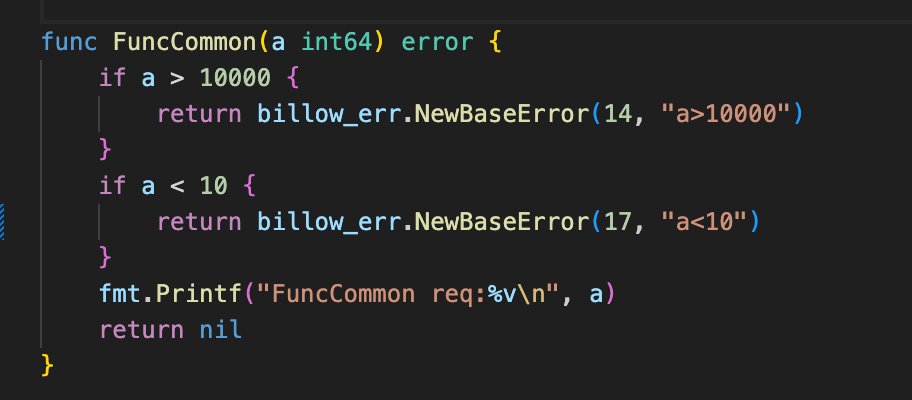

# 错误码生成工具

遵循某种特定规范的一组独特数字，其具备重要的作用。它能够迅速且精准地定位异常类型和异常代码所在的具体位置，为排查业务问题提供了关键的线索和方向。通过对错误码的分析和解读，相关人员可以快速了解问题的性质和严重程度，从而采取有效的解决措施，提高业务处理的效率和质量，减少因问题排查所耗费的时间和成本。

--- 

使用错误码时候会遇到常见的两个问题：

- 若要实现错误码对异常代码的快速定位，除了部分通用错误（如参数缺失、参数异常等）可复用同一错误码外，大部分异常代码都需单独的错误码来表示。这意味着倘若一个需求新增 5 个异常点，便需新增 5 个错误码予以唯一标识。而且，每次新增错误码时，还需要在相应的代码中进行定义、注释和文档更新等工作，这更增加了代码的维护成本。
- 当多个上游调用同一个函数时，由于缺乏有效的跟踪机制，难以迅速确定是哪个上游在调用。这给问题的排查和定位带来了极大的困难，往往需要耗费大量的时间和精力去逐一排查各个上游的调用情况，才能找到问题的根源

---

为了解决上面两个问题：

- 利用代码生成，基于ast库提供的能力。自动生成错误码，减少重复工作量
- 基于runtime.caller包获取当前程序调用栈中的某一层函数的详细信息，实现error链路追踪。

---

使用方法,在需要生成错误码的地方`billow_err.TodoBaseError`占位，代码完成后，使用`go:generate go run github.com/heucoder/billow_err/gen -path ./`生成：
```
//go:generate go get github.com/heucoder/billow_err/gen
//go:generate go run github.com/heucoder/billow_err/gen -path ./
func main() {
	err := f.FuncL1(10001)
	if err != nil {
		fmt.Printf("err:%+v\n", err)
	}
	billow_err.TodoBaseError("test 1")
	billow_err.TodoBaseError("test 2")
}

```
因为原始存在一个14的错误码，所以后续的错误码都在14基础上自动生成，确保之前有错误码被删除后，新生成的错误码也不会重复出现14:
- 原始


- 代码生成后的文件


- 输出的json文件
```[{"code":15,"msg":"\"test 1\""},{"code":16,"msg":"\"test 2\""},{"code":14,"msg":"\"a\u003e10000\""},{"code":17,"msg":"\"a\u003c10\""}]```
